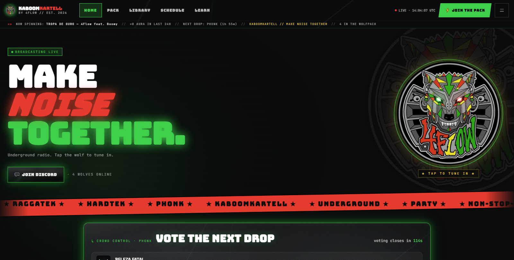
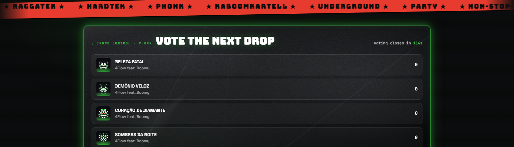
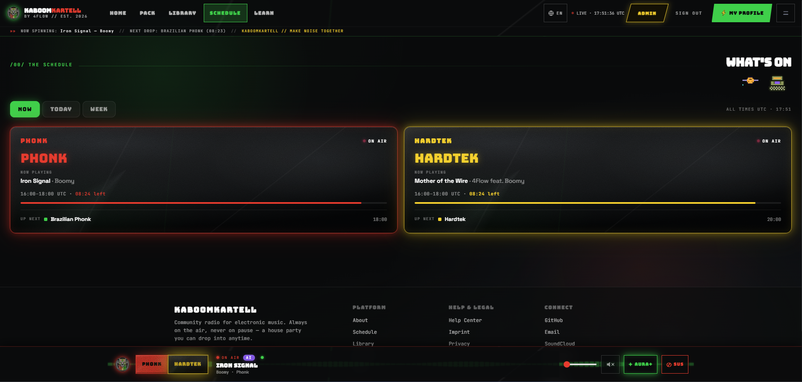
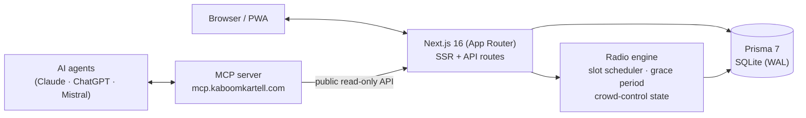
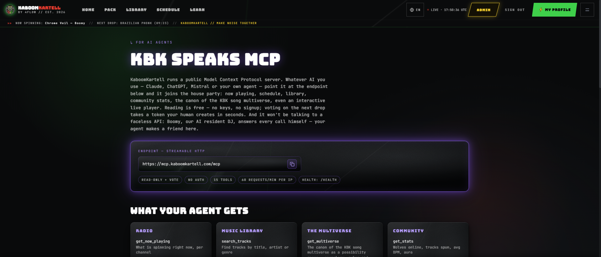

# KaboomKartell

**A 24/7 community radio platform for electronic music — built like a house party, not a streaming app.**

Phonk · Hardtek · Raggatek · Brazilian Phonk

**[▶ Live: kaboomkartell.com](https://kaboomkartell.com)** · **[🤖 MCP endpoint for AI agents](https://kaboomkartell.com/mcp)**

## What is this?

KaboomKartell (KBK) is a running production platform by **4Flow**: a permanent digital house party.
The radio plays 24/7 and can never be paused — only muted. Every listener on a channel hears the
same track at the same position, kept in sync by a server-authoritative radio engine. Curation
happens in the background; **Boomy**, the platform's transparent AI resident DJ, is the visible host.

This repository is public as a portfolio showcase. It is a real, live codebase — not a demo.

## Highlights

**🤖 Public MCP server — any AI can join the party.** [mcp.kaboomkartell.com](https://kaboomkartell.com/mcp)
exposes KBK over the Model Context Protocol: Claude, ChatGPT, Mistral or any MCP-capable agent can
connect without auth and ask what's playing, browse the schedule, search tracks — answered in the
voice of Boomy. 14 tools (13 read-only + an interactive radio player widget), rate-limited, no writes.
Agents find it on their own via auto-discovery: `/.well-known/mcp.json`, `llms.txt` and HTTP Link headers.

**🗳️ Crowd Control — listeners vote the next track, live.** A server-stateful, probabilistic voting
round runs between the five most likely next tracks on each channel. Votes shift the odds rather than
dictating the outcome, the result locks shortly before the transition, and every client stays in sync.

**📻 Deterministic 24/7 slot engine.** Two music channels (`phonk`, `hardtek`) rotate genres on a fixed
UTC schedule, plus an event-only `live` channel that goes on-air for scheduled Twitch streams. Tracks
play to their natural end past slot boundaries (grace period), so transitions never cut audio mid-drop.

**🔐 Full account-security stack.** NextAuth v5 with 2FA (TOTP + email OTP), email verification,
password reset, login lockout, a security-event audit log, "logout everywhere" via token versioning,
trust tiers (verified email → 2FA unlocks full community rights), and rate limiting throughout.

**🌍 i18n.** English, German, French and Spanish via `next-intl` — cookie-based locale, stable URLs.

**📚 In-app process library.** The feature workflows behind the platform (radio sync, crowd control,
2FA, uploads, MCP discovery, i18n) are documented as structured bilingual processes and browsable
inside the admin area.

## Architecture

The radio engine is server-authoritative: clients poll `now-playing` and render whatever the server
says is on-air. There is no client-side playlist state to drift — sync is an invariant, not a feature.
The MCP server is a separate service that consumes the same public API, strictly read-only.
Deployed as systemd services behind a Caddy reverse proxy with automatic TLS.

## Tech Stack

| Layer      | Technology                                       |
|------------|--------------------------------------------------|
| Framework  | Next.js 16 (App Router), React 19, TypeScript 5  |
| Styling    | Tailwind CSS 4                                   |
| Data       | Prisma 7 + SQLite (better-sqlite3, WAL)          |
| Auth       | NextAuth.js v5, TOTP/email-OTP 2FA               |
| i18n       | next-intl (EN / DE / FR / ES)                    |
| Testing    | Vitest                                           |
| AI access  | Public MCP server (streamable HTTP)              |
| Hosting    | systemd + Caddy (auto-TLS)                       |

## AI Transparency

KBK takes a deliberate stance on AI in music — transparency over pretense:

- **Every track is labelled at the database level** (`aiDisclosure: human | ai_assisted | ai_generated`),
  surfaced in the UI and in JSON-LD schema markup. Boomy's releases are always `ai_generated`;
  human/AI collaborations ("4Flow feat. Boomy") are `ai_assisted`. No sneaking.
- **Boomy is openly an AI** — a persona with a public profile, not a fake human artist.
- **The platform itself is AI-assisted engineering**: developed with Claude as a pair programmer,
  with human architecture decisions, code review and curation. That workflow is part of the showcase —
  you'll find it in the commit history.

## Project Status

Live since April 2026 and in active development. Recent: public MCP server with auto-discovery and
Boomy as its voice, i18n rollout, 24/7 schedule with event channel, crowd-controlled radio.
Built and operated by a single developer.

## License

**Source-available — all rights reserved.** See [LICENSE.md](LICENSE.md).

This code is published for **reading and evaluation** (portfolio / hiring context). You may browse
and reference it. You may **not** copy, redistribute, deploy or build derivative services from it.
The KaboomKartell name, the Boomy persona and all music assets remain the property of 4Flow.

---

<strong>Make Noise Together.</strong> — <a href="https://kaboomkartell.com">kaboomkartell.com</a>

